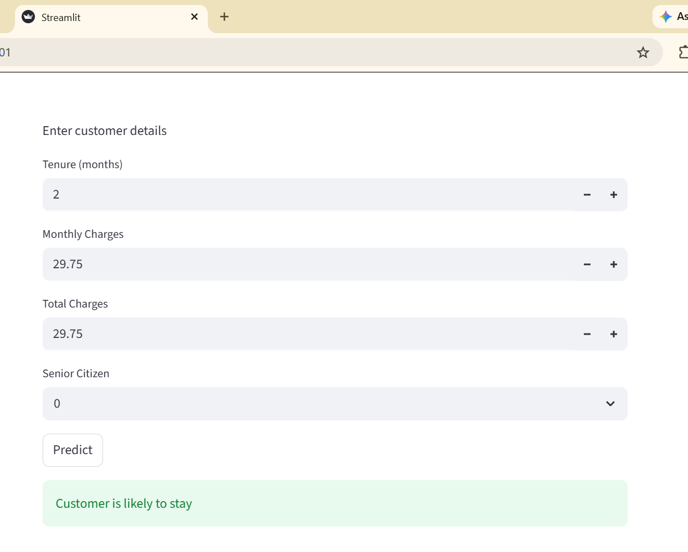

# Customer Churn Prediction

## Project Overview
This project predicts whether a customer is likely to churn using machine learning.

## Live Demo
Try the live app here:
https://churn-prediction-cwskltcv6vbu9k3ywk2atj.streamlit.app

## Tech Stack
- Python
- Pandas
- Scikit-learn
- Matplotlib
- Seaborn
- Jupyter Notebook

## Features
- Data cleaning
- Label encoding
- Train-test split
- Random Forest model training
- Accuracy score
- Confusion matrix
- Model saved as `model.pkl`
- Encoders saved as `encoders.pkl`

## Project Structure
churn-prediction/
│── data/
│   └── churn.csv
│── notebook.ipynb
│── model.pkl
│── encoders.pkl
│── requirements.txt
│── README.md

## How to Run
1. Install dependencies:
   `pip install -r requirements.txt`
2. Start Jupyter Notebook:
   `jupyter notebook`
3. Open `notebook.ipynb`

## Output
- Churn prediction model
- Accuracy score
- Confusion matrix
- Saved model and encodersS

## Dataset Preview

## Model Performance

The model was evaluated using standard classification metrics:

- Accuracy: 79.84%
- Precision: 66.30%
- Recall: 48.53%
- F1 Score: 56.04%

The model achieves good overall accuracy, but recall is relatively lower, indicating that some churn cases are not being captured.

### Confusion Matrix

## Feature Importance

## Web App Interface

