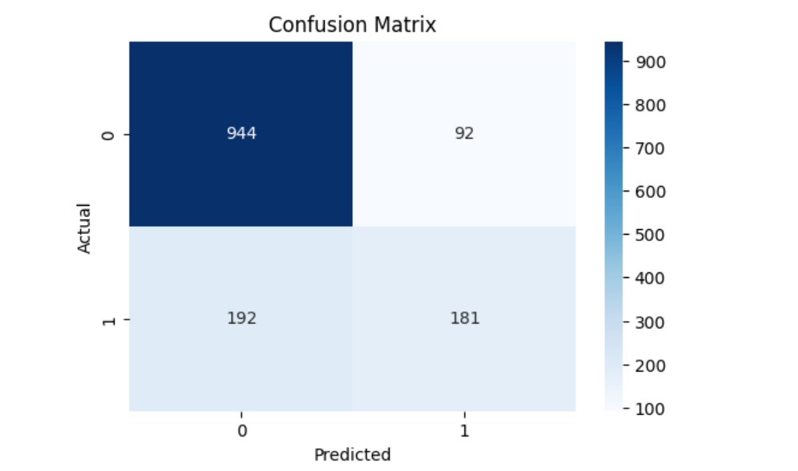
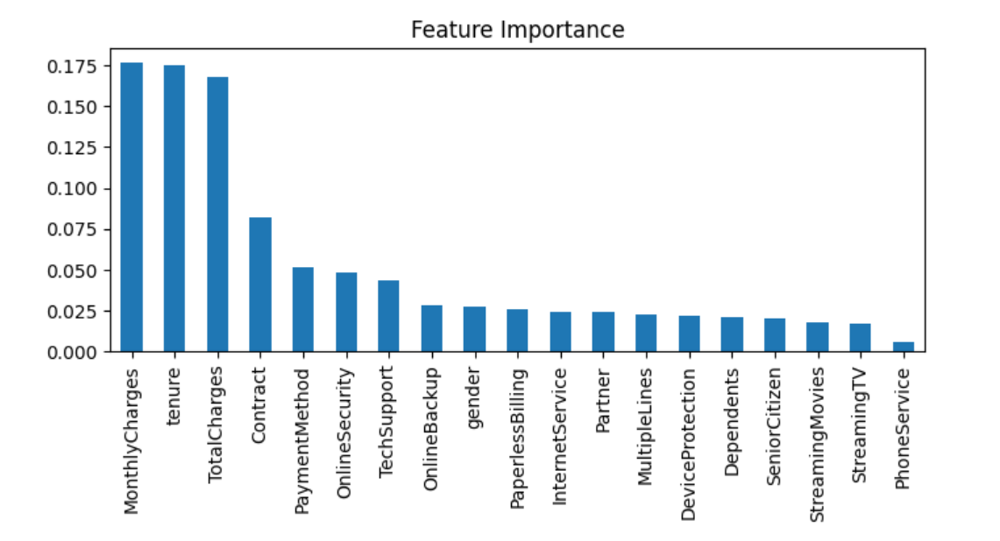
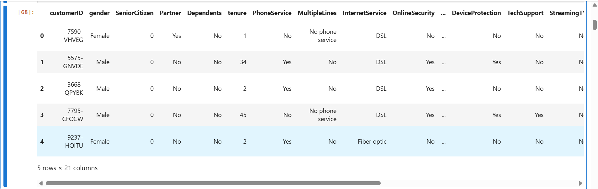
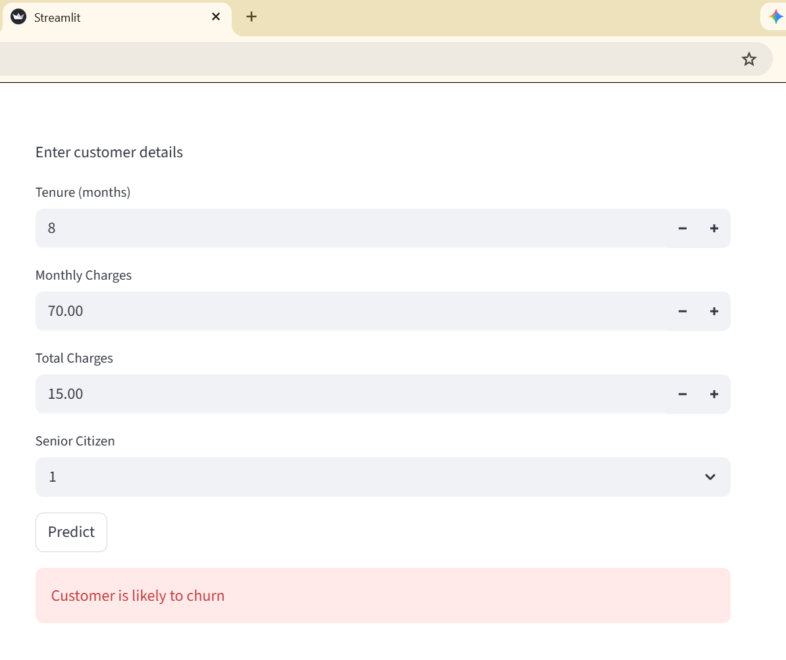

# 🚀 Customer Churn Prediction

A machine learning project that predicts whether a customer is likely to churn using behavioral and account data.

---

## 🌐 Live Demo

👉 https://churn-prediction-cwskltcv6vbu9k3ywk2atj.streamlit.app

---

## 📸 Application Preview


---

## 💡 Business Impact

This project helps businesses identify customers who are likely to leave their service, enabling proactive customer retention strategies and reducing revenue loss.

---

## 📊 Model Performance

The model was evaluated using standard classification metrics:

* Accuracy: 79.84%
* Precision: 66.30%
* Recall: 48.53%
* F1 Score: 56.04%

The model achieves strong overall accuracy while balancing precision and recall for churn prediction.

### Confusion Matrix



---

## 📈 Feature Importance



---

## 🧠 Key Features

* Data preprocessing and cleaning
* Label encoding
* Train-test split
* Random Forest model training
* Model evaluation using Accuracy, Precision, Recall, and F1 Score
* Feature importance analysis
* Interactive Streamlit web application
* Saved trained model (`model.pkl`)
* Saved encoders (`encoders.pkl`)

---

## 🛠️ Tech Stack

* Python
* Pandas
* NumPy
* Scikit-learn
* Matplotlib
* Seaborn
* Streamlit
* Jupyter Notebook

---

## 📂 Project Structure

```bash
churn-prediction/
│── data/
│   └── churn.csv
│── images/
│── notebook.ipynb
│── app.py
│── model.pkl
│── encoders.pkl
│── requirements.txt
│── README.md
```

---

## ▶️ How to Run

### 1️⃣ Install dependencies

```bash
pip install -r requirements.txt
```

### 2️⃣ Run the Streamlit application

```bash
streamlit run app.py
```

### 3️⃣ Open in browser

```bash
http://localhost:8501
```

---

## 📊 Dataset Preview



---

## 🖥️ Web App Interface

### Main Prediction Interface


### Prediction Output Interface


